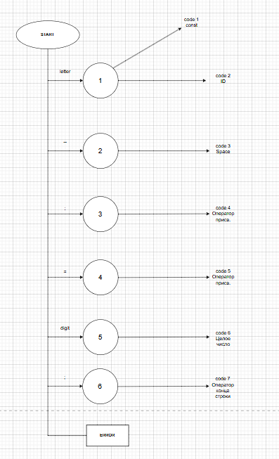

# Лабораторная работа №1

# Название и цель лабораторной работы.
Разработка пользовательского интерфейса (GUI) для языкового процессора
Цель: Создание кроссплатформенного графического интерфейса (GUI) для языкового процессора в виде специализированного текстового редактора.

# Сведения об авторе.
Сорочинский Михаил Владимирович, АВТ-314

# Описание проекта

Разработанное приложение представляет собой текстовый редактор на базе Python и PyQt6, предназначенный для ввода и редактирования исходного кода с возможностью последующего расширения до полноценного языкового процессора. Интерфейс программы состоит из четырех основных областей: главного меню, панели инструментов с кнопками быстрого доступа, области редактирования текста и области вывода результатов работы анализатора (только для чтения). Пользователь может свободно изменять размеры всех областей и всего окна, при необходимости автоматически появляются полосы прокрутки.

Главное меню включает четыре пункта: "Файл" (создание, открытие, сохранение, сохранение как, выход с подтверждением сохранения изменений), "Правка" (отмена/повтор, вырезание, копирование, вставка, удаление, выделение всего), "Пуск" (запуск синтаксического анализатора) и "Справка" (руководство пользователя и окно "О программе"). Все эти функции продублированы на панели инструментов в виде 11 цветных кнопок с подписями: Новый (синий), Открыть (зеленый), Сохранить (голубой), Отмена и Повтор (оранжевые), Копировать (фиолетовый), Вырезать (красный), Вставить (розовый), Пуск (зеленый), Справка (синий) и О программе (серый).

Редактор поддерживает все стандартные операции с текстом через горячие клавиши (Ctrl+N, Ctrl+O, Ctrl+S, Ctrl+Z, Ctrl+Y, Ctrl+X, Ctrl+C, Ctrl+V, Ctrl+A, F5 для анализа, F1 для справки). При закрытии программы или создании нового файла система запрашивает подтверждение сохранения изменений. В область вывода при нажатии кнопки "Пуск" выводится демонстрационная информация о запуске синтаксического анализатора с подсчетом количества строк и символов в текущем документе.

# Используемые технологии

Python и PyQt6

# Инструкция по сборке и запуску

1. Установите зависимости: pip install -r requirements.txt
2. Запустите: python main.py

# Руководство к пользованию

1. Панель инструментов 

2. Работа с файлами

3. Настройка интерфейса

Изменение размера шрифта, языка, область окна

5. Информация о программе

# Лабораторная работа №2

Название: Разработка лексического анализатора (сканера)

# Цель работы
Изучить назначение и принципы работы лексического анализатора в структуре компилятора. Спроектировать алгоритм (диаграмму состояний) и выполнить программную реализацию сканера для выделения лексем из входного текста. Интегрировать разработанный модуль в ранее созданный графический интерфейс языкового процессора.

# Постановка задачи
Разработать лексический анализатор (сканер) в соответствии с индивидуальным вариантом задания, интегрировать его в приложение из лабораторной работы №1 и обеспечить наглядный вывод результатов.

Требования к реализации сканера:

1. Спроектировать диаграмму состояний конечного автомата, реализующего сканер, согласно варианту задания.
2. Разработать программный модуль лексического анализа, который:
   
   2.1.принимает на вход строку (исходный текст программы);
   
   2.2.выделяет все допустимые лексемы согласно варианту;
   
   2.3.классифицирует лексемы по типам (например: "ключевое слово", "идентификатор", "число", "оператор", "разделитель").
   
   2.4.любые символы, не соответствующие ни одному из допустимых типов лексем, считать недопустимыми и выводить сообщение об ошибке с указанием позиции.
   
   2.5.учитывает многострочность входного текста.

# Вариант задания
Объявление целочисленной константы с инициализацией на языке Rust

# Допустимые лексемы (токены)

1.Ключевое слово: const (обозначает начало объявления константы).

2.Идентификатор (ID): Имя константы. Должно соответствовать правилам именования в Rust (начинается с буквы или подчеркивания, далее буквы, цифры или подчеркивания).

3.Символ двоеточия: : (отделяет имя переменной от типа).

4.Тип данных: Одно из ключевых слов, обозначающих целочисленные типы в Rust:

   4.1.Знаковые: i8, i16, i32, i64, i128, isize.
   
   4.2.Беззнаковые: u8, u16, u32, u64, u128, usize.
   
5.Символ присваивания: = (оператор инициализации).

6.Целочисленный литерал: Числовое значение. Может быть записано в разных системах счисления (десятичной, шестнадцатеричной 0x, восьмеричной 0o, двоичной 0b) и может содержать символ подчеркивания _ для улучшения читаемости (например, 1_000).

7.Символ точки с запятой: ; (обязательный терминатор инструкции в Rust).

# Примеры корректных входных строк
1. const MAX_SIZE: u32 = 100;
2. const COLOR_RED: i32 = 0xFF0000;
3. const MARKS: i32 = 100;

