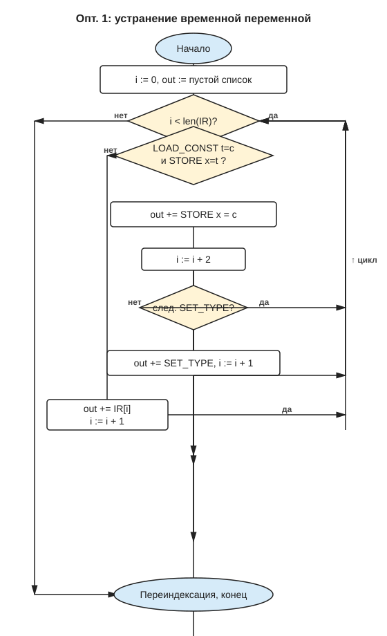
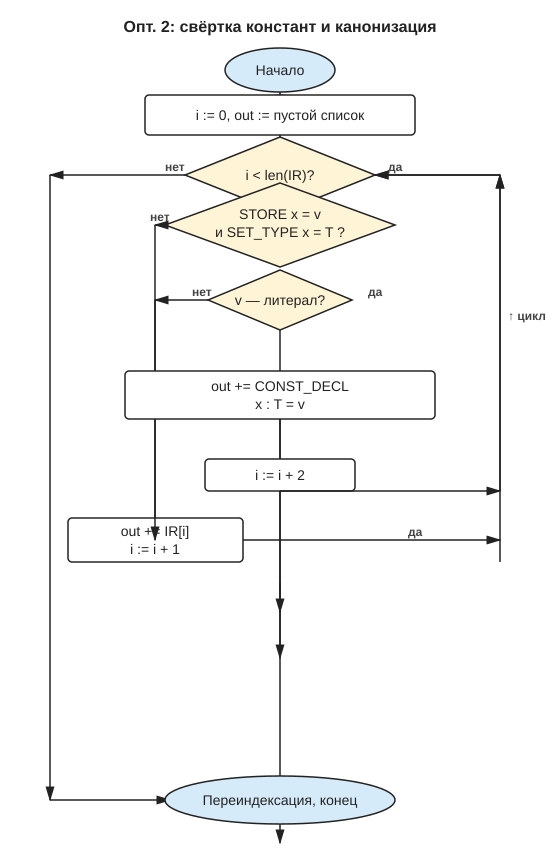

# Лабораторная работа №1

# Название и цель лабораторной работы.
Разработка пользовательского интерфейса (GUI) для языкового процессора
Цель: Создание кроссплатформенного графического интерфейса (GUI) для языкового процессора в виде специализированного текстового редактора.

# Сведения об авторе.
Сорочинский Михаил Владимирович, АВТ-314

# Описание проекта

Разработанное приложение представляет собой текстовый редактор на базе Python и PyQt6, предназначенный для ввода и редактирования исходного кода с возможностью последующего расширения до полноценного языкового процессора. Интерфейс программы состоит из четырех основных областей: главного меню, панели инструментов с кнопками быстрого доступа, области редактирования текста и области вывода результатов работы анализатора (только для чтения). Пользователь может свободно изменять размеры всех областей и всего окна, при необходимости автоматически появляются полосы прокрутки.

Главное меню включает четыре пункта: "Файл" (создание, открытие, сохранение, сохранение как, выход с подтверждением сохранения изменений), "Правка" (отмена/повтор, вырезание, копирование, вставка, удаление, выделение всего), "Пуск" (запуск синтаксического анализатора) и "Справка" (руководство пользователя и окно "О программе"). Все эти функции продублированы на панели инструментов в виде 11 цветных кнопок с подписями: Новый (синий), Открыть (зеленый), Сохранить (голубой), Отмена и Повтор (оранжевые), Копировать (фиолетовый), Вырезать (красный), Вставить (розовый), Пуск (зеленый), Справка (синий) и О программе (серый).

Редактор поддерживает все стандартные операции с текстом через горячие клавиши (Ctrl+N, Ctrl+O, Ctrl+S, Ctrl+Z, Ctrl+Y, Ctrl+X, Ctrl+C, Ctrl+V, Ctrl+A, F5 для анализа, F1 для справки). При закрытии программы или создании нового файла система запрашивает подтверждение сохранения изменений. В область вывода при нажатии кнопки "Пуск" выводится демонстрационная информация о запуске синтаксического анализатора с подсчетом количества строк и символов в текущем документе.

# Используемые технологии

Python и PyQt6

# Инструкция по сборке и запуску

1. Установите зависимости: pip install -r requirements.txt
2. Запустите: python main.py


# Руководство к пользованию

1. Панель инструментов 


2. Работа с файлами


3. Настройка интерфейса


Изменение размера шрифта, языка, область окна

5. Информация о программе


# Лабораторная работа №2

Название: Разработка лексического анализатора (сканера)

# Цель работы
Изучить назначение и принципы работы лексического анализатора в структуре компилятора. Спроектировать алгоритм (диаграмму состояний) и выполнить программную реализацию сканера для выделения лексем из входного текста. Интегрировать разработанный модуль в ранее созданный графический интерфейс языкового процессора.

# Постановка задачи
Разработать лексический анализатор (сканер) в соответствии с индивидуальным вариантом задания, интегрировать его в приложение из лабораторной работы №1 и обеспечить наглядный вывод результатов.

Требования к реализации сканера:

1. Спроектировать диаграмму состояний конечного автомата, реализующего сканер, согласно варианту задания.
2. Разработать программный модуль лексического анализа, который:
   
   2.1.принимает на вход строку (исходный текст программы);
   
   2.2.выделяет все допустимые лексемы согласно варианту;
   
   2.3.классифицирует лексемы по типам (например: "ключевое слово", "идентификатор", "число", "оператор", "разделитель").
   
   2.4.любые символы, не соответствующие ни одному из допустимых типов лексем, считать недопустимыми и выводить сообщение об ошибке с указанием позиции.
   
   2.5.учитывает многострочность входного текста.


# Вариант задания
Объявление целочисленной константы с инициализацией на языке Rust

# Допустимые лексемы (токены)

1.Ключевое слово: const (обозначает начало объявления константы).

2.Идентификатор (ID): Имя константы. Должно соответствовать правилам именования в Rust (начинается с буквы или подчеркивания, далее буквы, цифры или подчеркивания).

3.Символ двоеточия: : (отделяет имя переменной от типа).

4.Тип данных: Одно из ключевых слов, обозначающих целочисленные типы в Rust:

   4.1.Знаковые: i8, i16, i32, i64, i128, isize.
   
   4.2.Беззнаковые: u8, u16, u32, u64, u128, usize.
   
5.Символ присваивания: = (оператор инициализации).

6.Целочисленный литерал: Числовое значение. Может быть записано в разных системах счисления (десятичной, шестнадцатеричной 0x, восьмеричной 0o, двоичной 0b) и может содержать символ подчеркивания _ для улучшения читаемости (например, 1_000).

7.Символ точки с запятой: ; (обязательный терминатор инструкции в Rust).

# Примеры корректных входных строк
1. const MAX_SIZE: u32 = 100;
2. const COLOR_RED: i32 = 0xFF0000;
3. const MARKS: i32 = 100;

# Диаграмма состояний


# Тестовые примеры

КОРРЕКТНАЯ СТРОКА
1. Входная строка: const MAX_SIZE: u32 = 100;

Выход:


СТРОКА С НЕДОПУСТИМЫМ СИМВОЛОМ
1. Входная строка: const MARKS: i32 = 100@;

Выход:


МНОГОСТРОЧНЫЙ ВВОД
1. Входная строка: const MAX_SIZE: u32 = 100; /n const MARKS: i32 = 100;

Выход: 


# Лабораторная работа №3

Название: Разработка синтаксического анализатора (парсера)

# Цель работы
Изучить назначение и принципы работы синтаксического анализатора в структуре компилятора. Спроектировать грамматику, построить соответствующую схему метода анализа грамматики и выполнить программную реализацию парсера с нейтрализацией синтаксических ошибок методом Айронса. Интегрировать разработанный модуль в ранее созданный графический интерфейс языкового процессора.

# Вариант задания
Объявление целочисленной константы с инициализацией на языке Rust

# Допустимые лексемы (токены)

1.Ключевое слово: const (обозначает начало объявления константы).

2.Идентификатор (ID): Имя константы. Должно соответствовать правилам именования в Rust (начинается с буквы или подчеркивания, далее буквы, цифры или подчеркивания).

3.Символ двоеточия: : (отделяет имя переменной от типа).

4.Тип данных: Одно из ключевых слов, обозначающих целочисленные типы в Rust:

   4.1.Знаковые: i8, i16, i32, i64, i128, isize.
   
   4.2.Беззнаковые: u8, u16, u32, u64, u128, usize.
   
5.Символ присваивания: = (оператор инициализации).

6.Целочисленный литерал: Числовое значение. Может быть записано в разных системах счисления (десятичной, шестнадцатеричной 0x, восьмеричной 0o, двоичной 0b) и может содержать символ подчеркивания _ для улучшения читаемости (например, 1_000).

7.Символ точки с запятой: ; (обязательный терминатор инструкции в Rust).

# Примеры корректных входных строк
1. const MAX_SIZE: u32 = 100;
2. const COLOR_RED: i32 = 0xFF0000;
3. const MARKS: i32 = 100;


# Разработка грамматики


# Классификация грамматики 
Грамматика автоматная 


# Метод анализа - граф автоматной грамматики


# Диагностика и нейтрализация синтаксических ошибок

Известно, что нет общих методов нейтрализации синтаксических ошибок. В каждом трансляторе эта проблема решается посвоему в зависимости от грамматики и выбранного метода трансляции. Для данной грамматики представляется удобным использовать
идею, впервые предложенную Айронсом для нисходящих распознавателей. Особенность грамматики заключается в построчном
описании операций, разделенных символом «;». При этом нейтрализация ошибок в каждой строке состоит в исключении терминалов
до «;» – тем самым производится исключение только одного неверного оператора. Синтаксически верные тексты подвергаются следующему этапу трансляции – семантическому анализу 


# Тестовые примеры

1. Входная строка: const = i32  100

   Выход:
   

2. Входная строка: const MARKS::::: i32 ====== 100; HDNJFKD

   Выход: 


# Лабораторная работа №4

Название: Реализация алгоритма поиска подстрок с помощью регулярных выражений

# Цель работы
Изучить теоретические основы регулярных выражений и их применение для поиска и извлечения подстрок из текста. Освоить практические навыки использования библиотечных средств работы с регулярными выражениями, а также интеграцию алгоритмов поиска в графический интерфейс приложения.


# Постановка задачи

Разработать модуль поиска подстрок с использованием регулярных выражений, интегрировать его в существующее приложение (текстовый редактор) и обеспечить наглядный вывод результатов.

I задача: Построить РВ для того, чтобы сопоставить все числа, которые не заканчиваются на 5.

II задача: Построить РВ, описывающее номера карт, принадлежащих платежной системе Мир.

III задача: Построить РВ для проверки надежности пароля. Требования к надежности пароля: Имеет длину не менее 12 символов. Хотя бы одна заглавная английская буква. Хотя бы одна строчная английская буква. Хотя бы одна цифра. Хотя бы один специальный символ из списка: /#?!@_$/%\^&*-|.

# Решение задач

I задача:

Регулярное выражение:  ^\d*[0-46-9]$


Примеры строк, которые должны находиться: 44, 56, 67, 89
Примеры строк, которые не должны находиться: 55, 345, 675, 25

Тестовые примеры:


II задача:

Регулярное выражение:  ^(220[0-4])\d{12,15}$


Примеры строк, которые должны находиться: 2200123456789012, 2201123456789012, 2203123456789012
Примеры строк, которые не должны находиться: 220012345678901, 2205123456789012, 22001234567890a2 

Тестовые данные:


III задача:

Регулярное выражение: ^(?=.*[A-Z])(?=.*[a-z])(?=.*\d)(?=.*[/#?!@_$%^&*\-|]).{12,}$"


Примеры строк, которые должны находиться: Aa1@12345678, Password123! 
Примеры строк, которые не должны находиться: abc123A!, Pass1!  

Тестовые данные:


# Дополнительное задание


# Лабораторная работа №5

Название: Построение AST и проверка контекстно-зависимых условий

# Цель работы
Изучить назначение и принципы работы семантического анализатора в структуре компилятора. Освоить методы построения абстрактного синтаксического дерева (AST) и проверки контекстно-зависимых условий (семантических правил) для заданной синтаксической конструкции.

# Вариант задания
Объявление целочисленной константы с инициализацией на языке Rust

# Примеры верных строк

const MARKS: i32 = 100;
const WAN: i32 = 5467;

# Контекстно-зависимые условия

| № | Проверка | Пример | Ожидаемое сообщение |
|---|------------|--------|---------------------|
| 1 | Уникальность имён | `const A: i32 = 1;` затем `const A: i32 = 2;` | `Ошибка: идентификатор "A" уже объявлен ранее (строка {prev_line})` |
| 2 | Совместимость типа и литерала | `const OTHER: u8 = 300;` | `Ошибка: значение 300 вне допустимого диапазона для типа u8 ([0, 255]); несовместимость типа инициализатора` |


# Структура AST:

## Типы узлов дерева разбора (`SyntaxTreeNode`, поле `node_type`)

| `node_type` | Назначение |
|-------------|------------|
| `program` | Корень программы: список объявлений констант. Дочерние узлы — `const_declaration`. |
| `const_declaration` | Одно объявление вида `const имя : тип = значение ;`. Дети по порядку: `keyword` → `identifier` → `type` → `value`. |
| `keyword` | Ключевое слово `const`. |
| `identifier` | Имя константы. |
| `type` | Имя типа данных (`i32`, `u8` и т.д.). |
| `value` | Целочисленный литерал инициализатора (справа от `=`). |


## Рисунок AST для верной строки


## Формат вывода AST в программе


# Тестовые примеры (скриншоты)


# Инструкция по запуску: краткое описание, как скомпилировать и запустить проект.

## Запуск проекта
### Требования
- **Python 3** (рекомендуется 3.10+)
- Установленный **pip**
### Установка зависимостей
В каталоге `kurs_py` (где лежит `requirements.txt`):
```bash
pip install -r requirements.txt
```
Запуск
Перейти в каталог с main.py (kurs_processor) и выполнить:

```bash
python main.py
```


# Лабораторная работа №6

Название: Создание внутренней формы представления программы

Вариант задания: Грамматика на языке Rust
Язык программирования: Rust

Полное определение грамматики:

E → TA

A → ε | + TA | - TA

T → FB

B → ε | * FB | / FB | % FB

F → num | id | (E)

id → letter {letter | digit | _}

num → digit {digit}


Примеры верных строк:

1. 1 + 2
2. 10 / 2
3. 2 + (3 -2)
4. 35 * 2 - 45


# Лексические и синтаксические ошибки

Диаграмма лексера:


Схема рекурсивного спуска:


Тестовые примеры:


# Внутренняя форма представления программы (тетрады):


# ПОЛИЗ:


# Лабораторная работа №7

Название: Преобразование и анализ кода с использованием Clang и LLVM

# Цель работы
Познакомиться с инструментами Clang и LLVM, научиться получать абстрактное синтаксическое дерево (AST) и промежуточное представление (LLVM IR) для кода на C/C++, применять базовые оптимизации, строить граф потока управления (CFG), а также проанализировать влияние оптимизаций на синтаксические конструкции языка.

# Постановка задачи
1. Установить Clang, LLVM, opt и Graphviz.
2. Скомпилировать простой C-файл и получить AST и LLVM IR.
3. Использовать opt для оптимизации IR.
4. Построить CFG до и после оптимизаций.
5. Выполнить индивидуальное задание по варианту.

# Сведения об авторе.
Сорочинский Михаил Владимирович, АВТ-314

# Используемые технологии
Clang, LLVM, opt, Graphviz. Среда: Ubuntu (VirtualBox), LLVM 21.

В методичке указаны флаги `-dot-cfg` и `-constprop` для старого opt. В LLVM 21 используется синтаксис `opt -passes=...`. Вместо `-constprop` применяется проход `sccp`.

# Установка и подготовка среды

Команда установки:
```
sudo apt update
sudo apt install clang llvm graphviz -y
```


Проверка версий:
```
clang --version
opt --version
dot -V
```


Создание рабочей папки:
```
mkdir -p ~/lab7
cd ~/lab7
```


# Общая часть работы

# Исходный код main.c

Программа на языке C (пример из методички):

```
#include <stdio.h>

int square(int x) {
    return x * x;
}

int main() {
    int a = 5;
    int b = square(a);
    printf("%d\n", b);
    return 0;
}
```

# Получение AST

Команда:
```
clang -Xclang -ast-dump -fsyntax-only -fno-color-diagnostics main.c | tee main_ast.txt
```


# Генерация LLVM IR без оптимизаций (-O0)

Команда:
```
clang -O0 -S -emit-llvm main.c -o main_O0.ll
```

В файле main_O0.ll: переменные через alloca, много load и store, вызов функции square.


# Генерация LLVM IR с оптимизацией (-O2)

Команда:
```
clang -O2 -S -emit-llvm main.c -o main_O2.ll
```

После -O2: функция square может быть встроена и удалена, меньше инструкций, упрощение CFG.


# Оптимизация IR через opt

Команда:
```
opt -passes=default<O2> -S main_O0.ll -o main_opt_O2.ll
```


# Построение CFG (общая часть)

До оптимизации:
```
opt -passes=dot-cfg -disable-output main_O0.ll
dot -Tpng .main.dot -o main_cfg_O0.png
```


После оптимизации:
```
opt -passes=dot-cfg -disable-output main_O2.ll
dot -Tpng .main.dot -o main_cfg_O2.png
```

Если имя .dot файла отличается, выполнить: ls *.dot

CFG для main до оптимизации (-O0):


CFG для main после оптимизации (-O2):


# Выводы по общей части

1. AST отражает синтаксическую структуру программы (функции, параметры, вызовы).
2. При -O0 в IR много операций с памятью (alloca, load, store).
3. При -O2 IR упрощается: возможны inlining, mem2reg, constant folding.
4. CFG наглядно показывает упрощение потока управления после оптимизации.


# Индивидуальная часть работы

# Вариант задания
Целочисленные константы

# Исходный код const_int.c

```
const int LIMIT = 100;

int main() {
    int sum = 0;
    for (int i = 0; i < LIMIT; ++i) {
        sum += i;
    }
    return sum;
}
```

# Задания по варианту

1. Получить IR для -O0.
2. Применить -O2 и проверить, исчезла ли переменная LIMIT в логике программы.
3. Применить отдельно sccp (аналог constprop) и ipsccp.
4. Построить CFG до и после оптимизаций.
5. Сделать вывод о том, как и когда константа подставляется.


# Задание 1. IR для -O0

Команда:
```
clang -O0 -S -emit-llvm const_int.c -o const_int_O0.ll
```

Проверка:
```
grep -n -i limit const_int_O0.ll
grep -n "icmp" const_int_O0.ll
```

В IR: глобальная константа @LIMIT = 100, в main — цикл, сравнение icmp slt с 100.


# AST для const_int.c

Команда:
```
clang -Xclang -ast-dump -fsyntax-only -fno-color-diagnostics const_int.c > const_int_ast.txt
```

В AST: VarDecl для LIMIT, ForStmt, условие i < LIMIT.


# Задание 2. IR для -O2, исчезла ли LIMIT

Команда:
```
clang -O2 -S -emit-llvm const_int.c -o const_int_O2.ll
grep -n "LIMIT\|icmp" const_int_O0.ll const_int_O2.ll
```

Результат сравнения:

| Файл | @LIMIT в начале файла | icmp в main | Тело main |
|------|----------------------|-------------|-----------|
| const_int_O0.ll | есть | есть | цикл |
| const_int_O2.ll | может остаться | нет | ret i32 4950 |

Объявление @LIMIT в модуле IR может остаться, но цикл и icmp в main исчезают — сумма 0..99 вычислена при компиляции (4950).

Выход (grep):


Выход (фрагмент main в const_int_O2.ll):


# Задание 3. Проходы sccp и ipsccp

В LLVM 21 вместо -constprop:
```
opt -passes=sccp -S const_int_O0.ll -o const_int_sccp.ll
opt -passes=ipsccp -S const_int_O0.ll -o const_int_ipsccp.ll
```

Сравнение:
```
grep -n "LIMIT\|icmp" const_int_O0.ll const_int_sccp.ll const_int_ipsccp.ll
```

sccp — подстановка констант в пределах функции.
ipsccp — межпроцедурное распространение констант.


# Задание 4. CFG до и после оптимизаций

До (-O0):
```
opt -passes=dot-cfg -disable-output const_int_O0.ll
dot -Tpng .main.dot -o const_int_cfg_O0.png
```

После (-O2):
```
opt -passes=dot-cfg -disable-output const_int_O2.ll
dot -Tpng .main.dot -o const_int_cfg_O2.png
```

CFG до оптимизации (const_int_cfg_O0.png):


CFG после оптимизации (const_int_cfg_O2.png):


# Задание 5. Выводы по индивидуальной части

1. В исходнике const int LIMIT = 100 — константа с фиксированным значением.
2. При -O0 в IR есть @LIMIT и цикл с icmp ... 100.
3. При -O2 цикл свёрнут, main возвращает 4950; @LIMIT в заголовке файла может остаться, но в работе main не используется.
4. Pass sccp и ipsccp подставляют известные константы на этапе оптимизации IR.
5. Подстановка выполняется при оптимизации IR (clang -O2 или opt), а не при построении AST.
6. CFG до оптимизации содержит блоки цикла; после -O2 — один простой блок.


# Задание №6 - Ответы на контрольные вопросы.
1. Что такое Clang, и какова его роль в процессе компиляции программ?
   
Clang - это фронтенд компилятора. Он необходим для работы с исходным текстом программы (C/C++). Он проверяет синтаксис, строит абстрактное синтаксическое дерево (AST) и переводит код в промежуточное представление (LLVM IR).

2. Что представляет собой LLVM и как он используется в современных компиляторах?
   
LLVM - это модульная инфраструктура для разработки компиляторов, выполняющая роль оптимизатора и бэкенда. Современные компиляторы используют её как конструктор - берут готовые библиотеки LLVM для оптимизации универсального кода и его перевода в машинные инструкции конкретного процессора (x86, ARM).

3. Чем отличается абстрактное синтаксическое дерево (AST) от промежуточного представления LLVM IR?
  
- AST - это высокоуровневое дерево структуры кода, привязанное к синтаксису языка C/C++.
- LLVM IR - это низкоуровневый линейный ассемблер, полностью независимый от исходного языка программирования и оперирующий базовыми блоками, метками и регистрами.

4. Для чего необходимо промежуточное представление (IR) в процессе компиляции?
   
IR избавляет от необходимости писать отдельный компилятор под каждую пару «Язык - Процессор». Вместо этого все языки переводятся в один общий IR. Оптимизации пишутся один раз для IR, и они автоматически работают для любого входного языка и любого целевого процессора.

5. Что делает инструкция alloca в LLVM IR, и зачем она используется в функциях?
   
Инструкция alloca выделяет память на стеке текущего кадра функции для локальной переменной. Она используется, чтобы гарантировать переменной её физический адрес в памяти для корректного выполнения операций чтения (load) и записи (store).

6. Зачем нужна оптимизация кода в компиляторе, и какие основные цели она преследует?
   
Оптимизация нужна для улучшения характеристик программы без изменения логики её работы. Она позволяет увеличить скорость выполнения, уменьшить размер бинарного файла и снизить потребление оперативной памяти или энергии.

7. Что такое SSA-форма и почему она важна при оптимизации программ?
   
SSA (Static Single Assignment) - это форма кода, где каждому виртуальному регистру значение присваивается ровно один раз. Если переменная в C++ меняется, в IR создаются новые регистры (%x1, %x2). При ветвлениях используется специальная ϕ-функция (Phi-node) для выбора нужного значения. SSA важна, так как она убирает ложные зависимости между инструкциями, делая оптимизации простыми и быстрыми.

8. Что такое граф потока управления (CFG) и как он помогает анализировать поведение программы?

CFG - это ориентированный граф функции, где:
- Вершины - базовые блоки (куски кода без ветвления внутри, выполняющиеся строго линейно).
- Ребра - стрелки переходов (br, switch) между ними.
  
Он помогает компилятору видеть логику переходов, находить циклы, оптимизировать условия и удалять недостижимый код.

9. Как устроено представление арифметических операций в LLVM IR (например, умножение, сложение)?
    
Они представлены в строго типизированной трехадресной форме - операция принимает два операнда фиксированного типа и записывает результат в новый регистр. Также могут быть флаги (например, nsw - отсутствие знакового переполнения).
Пример: %res = add nsw i32 %0, %1 (сложение двух 32-битных целых чисел).

10. Почему функции в LLVM IR обычно представляют собой отдельные единицы анализа и оптимизации?
    
Функции обладают локальностью: у них изолированные переменные, четкие аргументы и границы. Анализировать всю программу сразу слишком долго и ресурсоемко, а анализ отдельных функций позволяет компилятору работать быстро и эффективно.

11. Что происходит с функцией в LLVM IR, если она вызывается один раз и очень короткая?
    
При включении оптимизаций (например, -O2) оптимизатор применяет инлайнинг (Inlining). Тело этой короткой функции встраивается прямо в место её вызова, а сама функция удаляется. Это убирает накладные расходы процессора на прыжки по коду (call/ret) и сохранение регистров.

12. Какие преимущества даёт использование IR и CFG для автоматических оптимизаций по сравнению с анализом исходного текста на C?
    
В IR нет синтаксического разнообразия: любые циклы (for, while, do-while) в IR превращаются в одинаковые базовые блоки и переходы br.
Действует строгое правило SSA, благодаря которому легко отслеживать, откуда взялось значение в регистре.
Граф CFG дает четкую математическую модель связей в коде, которую невозможно построить простым анализом текста на С из-за сложных областей видимости и макросов.


# Дополнительное задание

Продолжение лабораторной работы №5 (КР/РГР): построение AST, генерация промежуточного представления и две локальные оптимизации для конструкции **объявления целочисленной константы** на языке Rust.

## Постановка задачи

1. Построить абстрактное синтаксическое дерево (AST) конструкции из лабораторной работы №5.
2. Сгенерировать промежуточное представление (IR) для данной конструкции в виде трёхадресного кода (TAC).
3. Реализовать две локальные оптимизации. Каждая оптимизация должна преобразовывать IR к эквивалентному, но более простому или каноническому виду.
4. Продемонстрировать работу оптимизаций на конкретных примерах: показать «входной IR» и «выходной IR» после применения каждой оптимизации.
5. Все пункты 1–4 должны быть внедрены в GUI программы (продолжение ЛР №5).

## Вариант задания

**Раздел 2.5 методички:** целочисленные константы.

**Конструкция (Rust):**

```rust
const MARKS: i32 = 100;
```

## AST конструкции

**Структура AST (семантическое дерево):**

```text
Program
└── ConstDeclNode
    ├── name: "MARKS"
    ├── modifiers: ['const']
    ├── type: TypeNode → "i32"
    └── value: IntegerLiteralNode → 100
```

**Рисунок AST** (вкладка «Семантика и AST», ЛР №5):


**Вывод AST в отчёте IR** (вкладка «IR и оптимизации»):


## Промежуточное представление IR

Для промежуточного представления используются следующие виртуальные инструкции трёхадресного кода (TAC):

| Инструкция | Описание |
|------------|----------|
| `LOAD_CONST` | Загрузка целочисленного литерала во временную переменную (`t0 = 100`). |
| `STORE` | Присваивание значения имени константы (`MARKS = t0` или `MARKS = 100`). |
| `SET_TYPE` | Фиксация типа объявления (`type(MARKS) = i32`). |
| `CONST_DECL` | Каноническая форма объявления после оптимизаций (`CONST MARKS : i32 = 100`). |

**Исходный IR** для `const MARKS: i32 = 100;` (до оптимизаций):

```text
  1  t0 = 100
  2  MARKS = t0
  3  type(MARKS) = i32
```

**Каноническая строка** (результат после обеих оптимизаций):

```text
const MARKS : i32 = 100;
```

## Оптимизации

### Оптимизация 1: Устранение временной переменной (copy propagation)

#### Текстовое описание

При генерации IR литерал сначала записывается во временную переменную `t0`, затем копируется в имя константы. Если временная используется ровно один раз (цепочка `LOAD_CONST` → `STORE`), оптимизация заменяет копирование прямым присваиванием литерала имени. Применяется к конструкциям вида `const MARKS: i32 = 100;`.

**Условие:** подряд идут `t = литерал` и `имя = t`, при этом `t` больше нигде не используется.

**Преобразование:**

| До | После |
|----|-------|
| `t0 = 100`<br>`MARKS = t0`<br>`type(MARKS) = i32` | `MARKS = 100`<br>`type(MARKS) = i32` |

#### Преимущества

- Удаление избыточной временной переменной `t0`
- Сокращение числа инструкций IR с 3 до 2
- Упрощение цепочки присваиваний (аналог упрощения load/store в LLVM, `-instcombine`)
- Подготовка IR к свёртке констант на следующем шаге

#### Блок-схема

Файл для draw.io: [`diagrams/opt1_copy_propagation.drawio`](diagrams/opt1_copy_propagation.drawio)



### Оптимизация 2: Свёртка констант и канонизация объявления

#### Текстовое описание

Значение литерала (`100`) известно на этапе компиляции. Оптимизация объединяет инструкции `STORE` (имя и литерал) и `SET_TYPE` (тип) в одну каноническую инструкцию `CONST_DECL`, эквивалентную исходному объявлению `const` в исходном коде. Применяется после оптимизации 1, когда в IR остались `MARKS = 100` и `type(MARKS) = i32`.

**Условие:** подряд идут `имя = литерал` и `type(имя) = T`.

**Преобразование:**

| До | После |
|----|-------|
| `MARKS = 100`<br>`type(MARKS) = i32` | `CONST MARKS : i32 = 100` |

#### Преимущества

- Свёртка константы: литерал подставляется напрямую (аналог `-constprop` / SCCP в LLVM)
- Канонизация: IR приводится к виду, близкому к исходной строке `const … ;`
- Сокращение IR до одной инструкции на объявление
- Упрощение последующего анализа и вывода в отчёте

#### Блок-схема

Файл для draw.io: [`diagrams/opt2_constant_fold.drawio`](diagrams/opt2_constant_fold.drawio)



## Таблица преобразований IR

| Этап | IR |
|------|-----|
| Исходный (после `generate_tac`) | `t0 = 100` → `MARKS = t0` → `type(MARKS) = i32` |
| После оптимизации 1 | `MARKS = 100` → `type(MARKS) = i32` |
| После оптимизации 2 | `CONST MARKS : i32 = 100` |

## Тестовые примеры

### Пример: `const MARKS: i32 = 100;`

В редакторе вводится **исходный код** (не TAC). Нажимается **F5** (Пуск). Результат — на вкладке **«IR и оптимизации»**.

**Вкладка «IR и оптимизации»** (полный отчёт: AST, исходный IR, IR после опт. 1 и 2, каноническая строка):


**Фрагмент: исходный IR и результат оптимизаций:**


**Каноническая строка в отчёте:**


### Пример: несколько объявлений

```rust
const MAX_SIZE: u32 = 100;
const MARKS: i32 = 100;
```

Для каждого корректного объявления в IR строится отдельная тройка инструкций; оптимизации применяются к каждому блоку последовательно.

## Где происходят генерация IR и оптимизации

Оптимизации выполняются **в коде Python** (не в GUI). Интерфейс вызывает анализ по **F5** и показывает результат на вкладке **«IR и оптимизации»**.

| Этап | Файл | Функция |
|------|------|---------|
| Построение AST | `semantic_analysis.py` | `build_ast_from_syntax_tree()`, `analyze_semantics_from_parse()` |
| Генерация IR (TAC) | `ir_codegen.py` | `generate_tac()` |
| Оптимизация 1 — устранение временной переменной | `ir_optimize.py` | `optimize_eliminate_temp_copy()` |
| Оптимизация 2 — свёртка констант и канонизация | `ir_optimize.py` | `optimize_fold_and_canonical()` |
| Цепочка: IR → опт. 1 → опт. 2 | `ir_optimize.py` | `apply_optimizations()` |
| Сборка отчёта для вкладки | `ir_pipeline.py` | `format_ir_pipeline_report()` |
| Вызов из GUI | `editor.py` | `run_analyzer()` |

**Цепочка обработки:**

```text
const MARKS: i32 = 100;   ← редактор (исходник)
        ↓
Лексика → Синтаксис → Семантика → valid_ast
        ↓
generate_tac()                    → исходный IR (3 инструкции)
        ↓
optimize_eliminate_temp_copy()    → оптимизация 1
        ↓
optimize_fold_and_canonical()     → оптимизация 2
        ↓
Вкладка «IR и оптимизации»
```

## Выводы по дополнительному заданию

1. Для объявления целочисленной константы `const MARKS: i32 = 100;` построены **AST** и **TAC**; исходный IR отражает пошаговую инициализацию (литерал → имя → тип).
2. **Оптимизация 1** устраняет избыточную временную переменную — аналог упрощения цепочки присваиваний в LLVM (`-instcombine`).
3. **Оптимизация 2** выполняет **свёртку константы** и **канонизацию** объявления — аналог подстановки констант (`-constprop`, SCCP) в индивидуальной части ЛР №7.
4. Обе оптимизации **локальны** (в пределах одного объявления) и **сохраняют семантику** программы.
5. Результаты всех этапов доступны в GUI без ручного запуска отдельных модулей.

## Связь с индивидуальным заданием ЛР №7 (LLVM)

| Этап в Clang/LLVM (`const_int.c`) | Аналог в проекте (доп. задание) |
|-----------------------------------|----------------------------------|
| IR `-O0`: `alloca`, load/store, цикл | исходный TAC: `t0 = 100`, `MARKS = t0`, `type(MARKS) = i32` |
| IR `-O2`: подстановка `LIMIT`, свёртка цикла | оптимизация 2: `CONST MARKS : i32 = 100` |
| Константа известна при компиляции | литерал `100` подставляется напрямую в имя `MARKS` |


    

    


